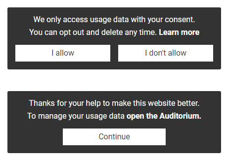
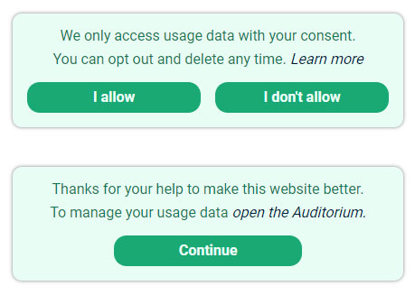
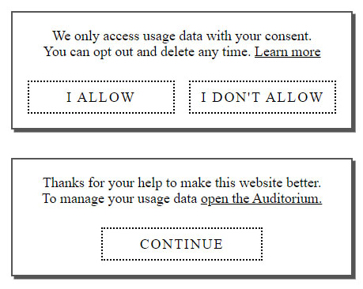

<!--
Copyright 2021 - Offen Authors <hioffen@posteo.de>
SPDX-License-Identifier: Apache-2.0
-->

# Customizing the consent banner
{: .no_toc }

Offen Fair Web Analytics lets you customize the appearance of the consent banner by appending custom CSS provided by yourself. To edit the CSS, navigate to the "Customize appearance" tab in the Auditorium. Appearance is customized at account level, so you can add different styles for different accounts. It's currently not possible to share the appearance of multiple accounts using other means than manually copy / pasting the contents. Only a selected subset of CSS is allowed to prevent XSS or injecting tracking into the consent banner.

---

## Table of contents
{: .no_toc }
1. TOC
{:toc}

## Examples

### Simple dark theme

A simple style change to match the banner to a dark themed website.



```
.banner__root {
  box-shadow: none;
  border: none;
  color: white;
  background-color: #333333;
}

.buttons__button {
  color: #333333;
  background-color: white;
}
```

### Peppermint theme

Colors, shapes, and basic font specifications can be adapted to meet an existing design.



```
.banner__root {
  color: #137752;
  background-color: #e8fdf5;
  border: none;
  border-radius: 10px;
  box-shadow: 0 0 4px 0 rgb(0 0 0 / 50%);
}

.paragraph__anchor {
  font-weight: normal;
  font-style: italic;
  color: #001b44;
}

.buttons__button {
  font-weight: bold;
  color: #e8fdf5;
  background-color: #19a974;
  border-radius: 14px;
}

.buttons__button:hover {
  background-color: #137752;
}
```

### Serif theme

More complex customizations are also possible. Changes to font size and spacing should be checked for readability with different media queries.



```
.banner__root {
  font-family: "Times New Roman", Times, serif;
  font-size: 18px;
  color: black;
  background-color: white;
  border-radius: 0;
  border: 0.15em solid #555555;
  box-shadow: 0.2em 0.2em 0 0 #555555;
}

.banner__paragraph {
  margin-bottom: 1.5em;
}

.banner__paragraph--first {
  margin: 0;
}

.paragraph__anchor {
  font-weight: normal;
  text-decoration: underline;
}

.buttons__button {
  text-transform: uppercase;
  letter-spacing: 0.1em;
  color: black;
  background-color: white;
  border-radius: 0;
  border: 2px dotted black;
}

.buttons__button:hover {
  background-color: white;
  border: 2px solid black;
}
```

## Allowed CSS properties and values

Certain validation rules apply to the CSS you can use for styling your banner: Offen Fair Web Analytics wants to make sure malicious actors could not change the appearance of your banner to be misleading when it comes to enabling users to express their consent freely.

### Selectors
{: .no_toc }

Selectors are only allowed to be classnames. In addition to that, only `:hover`, `:active` and `:focus` pseudo classes are allowed.

### Properties
{: .no_toc }

These CSS properties (as well as their vendor prefixed siblings if they exist) are blocked entirely:

- `opacity`
- `content`
- `filter`
- `behavior`
- `width`
- `cursor`
- `pointer-events`

### Values
{: .no_toc }

In values, all of these tokens are not allowed:

- `url`
- `expression`
- `javascript`
- `calc`
- `transform`
- `transparent`
- `-` (i.e. no negative values are allowed for anything)


### Other rules
{: .no_toc }

For `display`, the usage of `none` is not allowed. `font-size` can only be specified for the root element (`.banner__root`) and has to be a value in between 12px and 99px.

```
.paragraph_anchor {
  display: inline-block; /* ok */
}

.paragraph_anchor {
  display: none; /* not allowed */
}

.banner__root {
  font-size: 24px; /* ok */
}

.banner__root {
  font-size: 8px; /* not allowed */
}

.banner__buttons {
  font-size: 10px; /* not allowed */
}
```

### Changing the font family
{: .no_toc }

The usage of `url` is disallowed as it would allow attackers to inject tracking pixels or other external resources into the consent banner. This also means it's currently not possible to load external fonts. The default Stylesheet includes the `Roboto` font which you can use, but if you prefer to use other fonts, you can use system fonts only to do so:

```
.banner__host {
  font-family: georgia, times, serif;
}
```

## Styling the content vs. positioning the banner

To shield the consent banner from the host's stylesheets and also prevent other scripts from messing with it, its elements are placed inside an iframe element. This means, you currently __cannot change__ the positioning of the banner itself right now.

## Markup reference

The consent banner has two states: the initial screen and a follow up in case a user has decided to opt in.

Markup for each state is defined in the [`consent-banner` package][banner-source] and looks like this:

[banner-source]: https://github.com/offen/offen/blob/{{ site.offen_version }}/packages/consent-banner/index.js

### Initial state (pre consent)

```
<div class="banner__root bannner--inital">
  <p class="banner__paragraph banner__paragraph--first">
    We only access usage data with your consent.
  </p>
  <p class="banner__paragraph">
    You can opt out and delete any time.
    <a class="paragraph__anchor" target="_blank" rel="noopener" href="/">
      Learn more
    </a>
  </p>
  <div class="banner__buttons">
    <button class="buttons__button">
      I allow
    </button>
    <button class="buttons__button">
      I don't allow
    </button>
  </div>
  <style>
    /* default styles go here ... */
  </style>
</div>
<style>
  /* your styles go here ... */
</style>
```

### Follow up (after opting in)

```
<div class="banner__root banner--followup">
  <p class="banner__paragraph banner__paragraph--first">
    Thanks for your help to make this website better.
  </p>
  <p class="banner__paragraph">
    To manage your usage data <a class="paragraph__anchor" target="_blank" rel="noopener" href="/auditorium/">open the Auditorium.</a>
  </p>
  <div class="banner__buttons">
    <button class="buttons__button">
      Continue
    </button>
  </div>
  <style>
    /* default styles go here ... */
  </style>
</div>
<style>
  /* your styles go here ... */
</style>
```

### Default styles

The default stylesheet applied to the banner looks like this:

```
/* normalize.css is currently at version 8.0.1 */
@import url('node_modules/normalize.css/normalize.css');

* {
  box-sizing: border-box;
}

body {
  line-height: 1.15;
  margin: 0;
  padding: 8px;
  background-color: transparent;
}

.banner__root {
  color: #333;
  padding: 8px;
  border-radius: 3px;
  background-color: #fffdf4;
  border: 1px solid #8a8a8a;
  font-family: roboto, sans-serif;
  padding: 1em;
  box-shadow: 0px 0px 9px 0px rgba(0, 0, 0, 0.5);
}

@media all and (max-width: 389px) {
  body {
    font-size: .75em;
    padding: 8px 0;
  }
  .banner__root {
    border-radius: 0;
  }
}

.banner__paragraph {
  margin: 0 0 1em 0;
  text-align: center;
}

.banner__paragraph--first {
  margin-bottom: 0.5em;
}

.paragraph__anchor {
  color: inherit;
  font-weight: bold;
  text-decoration: none;
}

.banner__buttons {
  display: -webkit-box;
  display: -ms-flexbox;
  display: flex;
  -webkit-box-pack: center;
  -ms-flex-pack: center;
  justify-content: center;
  margin: 0 -0.5em;
}

.buttons__button {
  -webkit-appearance: button;
  background-color: #555;
  border: 0;
  color: white;
  cursor: pointer;
  font-family: inherit;
  font-size: 100%;
  padding: 0.5em 0;
  -webkit-transition: background-color .15s ease-out;
  transition: background-color .15s ease-out;
  width: 50%;
  margin: 0 0.5em;
}

.buttons__button:hover {
  background-color: #c4c4c4;
}
```
